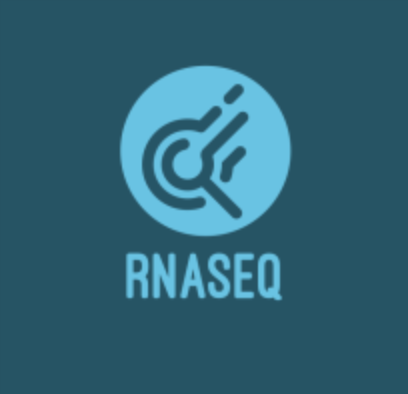

<!-- Improved compatibility of back to top link: See: https://github.com/othneildrew/Best-README-Template/pull/73 -->

<!--
*** Thanks for checking out the Best-README-Template. If you have a suggestion
*** that would make this better, please fork the repo and create a pull request
*** or simply open an issue with the tag "enhancement".
*** Don't forget to give the project a star!
*** Thanks again! Now go create something AMAZING! :D
-->

<!-- PROJECT SHIELDS -->
<!--
*** I'm using markdown "reference style" links for readability.
*** Reference links are enclosed in brackets [ ] instead of parentheses ( ).
*** See the bottom of this document for the declaration of the reference variables
*** for contributors-url, forks-url, etc. This is an optional, concise syntax you may use.
*** https://www.markdownguide.org/basic-syntax/#reference-style-links
-->
[![Contributors][contributors-shield]][contributors-url]
[![Forks][forks-shield]][forks-url]
[![Stargazers][stars-shield]][stars-url]
[![Issues][issues-shield]][issues-url]
[![MIT License][license-shield]][license-url]
[![LinkedIn][linkedin-shield]][linkedin-url]

<!-- PROJECT LOGO -->
 

  

<h3 align="center">RNAseq Pipeline</h3>

  

    An RNAseq Pipeline
     
    <a href="https://github.com/AoTechnologies/RNAseq"><strong>Explore the docs »</strong></a>
     
     
    <a href="https://github.com/AoTechnologies/RNAseq/issues">Report Bug</a>
    ·
    <a href="https://github.com/AoTechnologies/RNAseq/issues">Request Feature</a>
  

<!-- TABLE OF CONTENTS -->

  
Table of Contents

  <ol>
    <li>
      <a href="#about-the-project">About The Project</a>
      <ul>
        <li><a href="#built-with">Built With</a></li>
      </ul>
    </li>
    <li>
      <a href="#getting-started">Getting Started</a>
      <ul>
        <li><a href="#prerequisites">Prerequisites</a></li>
        <li><a href="#installation">Installation</a></li>
      </ul>
    </li>
    <li><a href="#usage">Usage</a></li>
    <li><a href="#roadmap">Roadmap</a></li>
    <li><a href="#contributing">Contributing</a></li>
    <li><a href="#license">License</a></li>
    <li><a href="#contact">Contact</a></li>
    <li><a href="#acknowledgments">Acknowledgments</a></li>
  </ol>

<!-- ABOUT THE PROJECT -->
## About The Project

An RNAseq pipeline I worked on for a internship at school. 

### Built With

* [![biomaRt][biomaRt]][biomaRt-url]
* [![DESeq2][DESeq2]][DESeq2-url]
* [![GEOfastq][GEOfastq]][GEOfastq-url]
* [![GEOquery][GEOquery]][GEOquery-url]
* [![plotly][plotly]][plotly-url]
* [![purrr][purrr]][purrr-url]
* [![Rsubread][Rsubread]][Rsubread-url]
* [![tidyverse][tidyverse]][tidyverse-url]

<!-- GETTING STARTED -->
## Getting Started

The file is a reproducable copy, open and run the code chunks in Rstudio. 

### Prerequisites

None

### Installation

Reproducable Code. Run the Rmarkdown in Rstudio and required packages will install in the first code chunk. 

<!-- USAGE EXAMPLES -->
## Usage

This pipeline was created to run the RNAseq data for the following accession.

<!-- ROADMAP -->
## Roadmap

None

<!-- CONTRIBUTING -->
## Contributing

Contributions are what make the open source community such an amazing place to learn, inspire, and create. Any contributions you make are **greatly appreciated**.

If you have a suggestion that would make this better, please fork the repo and create a pull request. You can also simply open an issue with the tag "enhancement".
Don't forget to give the project a star! Thanks again!

1. Fork the Project
2. Create your Feature Branch (`git checkout -b feature/AmazingFeature`)
3. Commit your Changes (`git commit -m 'Add some AmazingFeature'`)
4. Push to the Branch (`git push origin feature/AmazingFeature`)
5. Open a Pull Request

<!-- LICENSE -->
## License

Distributed under the MIT License. See `LICENSE.txt` for more information.

<!-- CONTACT -->
## Contact

Aaron Olschefski - [Linkedin](http://www.linkedin.com/in/aaron-ols) - aaron1412@gmail.com

Project Link: [https://github.com/AoTechnologies/RNAseq](https://github.com/AoTechnologies/RNAseq)

<!-- ACKNOWLEDGMENTS -->
## Acknowledgments

* [Dr. Michael Edwards](https://www.bioinfosolutions.com/about)
* [Dr. Tzu Phang](https://som.cuanschutz.edu/Profiles/Faculty/Profile/11531)

(<a href="#readme-top">back to top</a>)

<!-- MARKDOWN LINKS & IMAGES -->
<!-- https://www.markdownguide.org/basic-syntax/#reference-style-links -->
[contributors-shield]: https://img.shields.io/github/contributors/AoTechnologies/RNAseq.svg?style=for-the-badge
[contributors-url]: https://github.com/AoTechnologies/RNAseq/graphs/contributors
[forks-shield]: https://img.shields.io/github/forks/AoTechnologies/RNAseq.svg?style=for-the-badge
[forks-url]: https://github.com/AoTechnologies/RNAseq/network/members
[stars-shield]: https://img.shields.io/github/stars/AoTechnologies/RNAseq.svg?style=for-the-badge
[stars-url]: https://github.com/AoTechnologies/RNAseq/stargazers
[issues-shield]: https://img.shields.io/github/issues/AoTechnologies/RNAseq.svg?style=for-the-badge
[issues-url]: https://github.com/AoTechnologies/RNAseq/issues
[license-shield]: https://img.shields.io/github/license/AoTechnologies/RNAseq.svg?style=for-the-badge
[license-url]: https://github.com/AoTechnologies/RNAseq/blob/master/LICENSE.txt
[linkedin-shield]: https://img.shields.io/badge/-LinkedIn-black.svg?style=for-the-badge&logo=linkedin&colorB=555
[linkedin-url]: http://www.linkedin.com/in/aaron-ols
[product-screenshot]: images/screenshot.png
[biomaRt]: https://img.shields.io/badge/Bioconductor-biomaRt-blue
[biomaRt-url]: https://bioconductor.org/packages/release/bioc/html/biomaRt.html
[DESeq2]: https://img.shields.io/badge/Bioconductor-DESeq2-blue
[DESeq2-url]:https://bioconductor.org/packages/release/bioc/html/DESeq2.html
[GEOfastq]: https://img.shields.io/badge/Bioconductor-GEOfastq-blue
[GEOfastq-url]:https://www.bioconductor.org/packages/release/bioc/html/GEOfastq.html
[GEOquery]: https://img.shields.io/badge/Bioconductor-GEOquery-blue
[GEOquery-url]:https://bioconductor.org/packages/release/bioc/html/GEOquery.html
[plotly]: https://img.shields.io/badge/plotly-plotly-blue
[plotly-url]:https://plotly.com
[purrr]: https://img.shields.io/badge/tidyverse-purrr-blue
[purrr-url]:https://purrr.tidyverse.org
[Rsubread]: https://img.shields.io/badge/Bioconductor-Rsubread-blue
[Rsubread-url]:https://bioconductor.org/packages/release/bioc/html/Rsubread.html
[tidyverse]: https://img.shields.io/badge/tidyverse-tidyverse-blue
[tidyverse-url]:https://www.tidyverse.org
